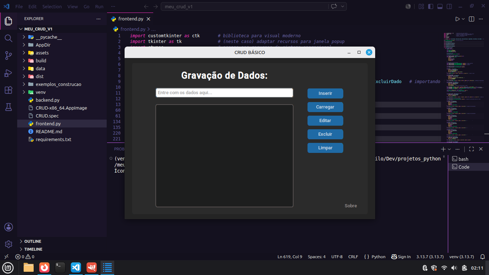

# CRUD Básico em Python (CustomTkinter)


## 📌 Descrição

Aplicação desktop desenvolvida em Python para manipulação de dados em formato de lista, utilizando interface gráfica moderna com CustomTkinter.

O sistema permite inserir, visualizar, editar, excluir e carregar dados a partir de arquivos externos.

> ⚠️ Este projeto não utiliza persistência de dados, in-memory (armazenamento em memória apenas durante execução).

---

## 📷 Preview

<p align="center">
  
</p>

---

## 🚀 Funcionalidades

- ✅ Inserção de dados
- 📂 Carregamento de arquivos (.txt, .py, etc.)
- ✏️ Edição de itens selecionados
- ❌ Exclusão de dados
- 🧹 Limpeza completa da lista
- 🖱️ Seleção de linhas com destaque visual
- ⚠️ Sistema de alertas (popups)
- ℹ️ Tela "Sobre" com informações do sistema

---

## 🛠️ Tecnologias utilizadas

- Python 3
- CustomTkinter
- Tkinter
- OS / Sys (manipulação de sistema)
- Ctypes (customização da janela no Windows)

---

## 🧱 Estrutura do projeto
```
📂 crud-data-manager/
│
├── frontend.py        # Interface gráfica (UI)
├── backend.py         # Lógica das operações (CRUD)
├── 📂 assets/         # Ícones da aplicação
│ ├── list.ico
│ └── list.png
├── 📂 data/           # Dados para carregar (Exemplos)
│ ├── characters.txt
│ ├── names.txt
│ └── numbers.txt
├── preview.png         # Imagem do app aberto
├── requirements.txt    # Dependências do projeto
├── LICENSE             # Licença MIT
└── README.md           # Documentação do projeto
```
---

## 🧠 Arquitetura

O projeto segue uma separação simples entre:

- Frontend: responsável pela interface e interação com o usuário
- Backend: responsável pelas operações de dados

---

## ▶️ Como executar

1. Instale as dependências:

- pip install customtkinter

2. Execute o projeto:

- python frontend.py

---

## 📦 Empacotamento (opcional)

O projeto é compatível com PyInstaller:

pyinstaller --noconfirm --onefile --windowed --icon="assets/list.ico" --add-data "assets;assets" --name="CRUD" frontend.py 
---

## ⚠️ Limitações

- Não há persistência de dados
- Backend ainda acoplado à interface
- Tratamento de erros pode ser expandido

---

## 🔮 Melhorias futuras

- 💾 Persistência com SQLite ou JSON
- 🧩 Separação completa entre lógica e interface
- 📊 Adição de filtros e busca
- 📝 Sistema de logs
- 🎨 Melhorias visuais na UI

---

## 📜 Licença

Distribuído sob a **Licença MIT**.

Este projeto é open source e pode ser utilizado livremente para fins educacionais e de aprendizado.

---

## 👨‍💻 Autor

**Danilo Santos**  
🐙 GitHub: https://github.com/danilo-santos-python  
🌐 Repositório: https://github.com/danilo-santos-python/crud-data-manager

---

⭐ Se este projeto foi útil para você, deixe uma estrela no repositório.
